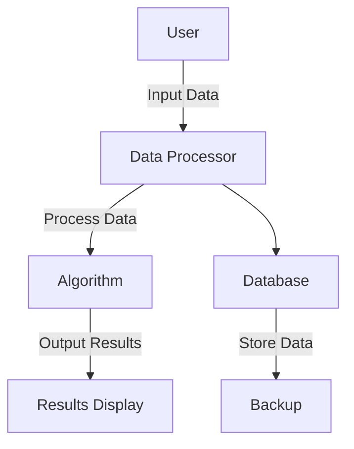

```mermaid
 graph TD;
     A[User] -->|Input Data| B[Data Processor];
     B -->|Process Data| C[Algorithm];
     C -->|Output Results| D[Results Display];
     B --> E[Database];
     E -->|Store Data| F[Backup];
```
